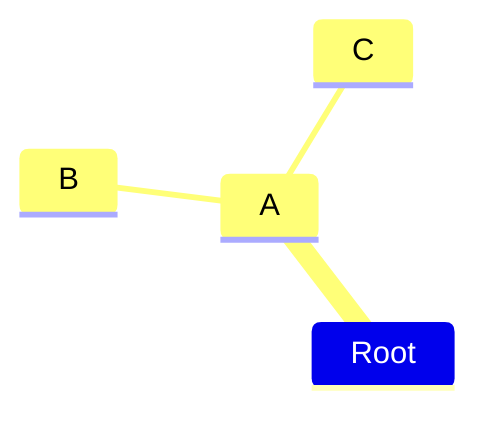

public key encryption or asymmetric encryption

two key
- public key
- private key

you use the private key to sign a messadge

you use the public key to verify a message

another asymetric encryption algorythem is ***RSA***
- rsa keys are larger
  - 256 for ECC
  - 3072 for RSA

***Trapdoor function*** 
: $A \rightarrow b$
- but you can not reverse it $ A \cancel{\leftarrow} b $

if you draw a line that intersects three points 
it will alway hit a third point.

# Diffie-Hellman Key Exchange 

there are two people who want to communicate with
each other securly ***Nick*** and ***Connie***

they share an aritary number: 
- **G**

each one comes up with their own secret key
- **Nick**: n
- **Connie**: c

the next thing they do is that they raise
the number **G** to their private secret number

**Nick**: 
$$ G^n = H_n $$

**Connie**:
$$ G^c = H_c $$

they now exchange those **H**s\
**connie** gets $H_n$\
and **Nick** gets $H_c$

so **G**, $H_n$ and $H_c$ are all publicly nown for everone
to see

now they they take the **H** they received and 
take that to the power of their random number

**Nick**:
$$ (H_c)^n = S$$

**Connie**:
$$ (H_n)^c = S$$

they should come up with the same value of **S**

**Nick**:
$$ S = (H_c)^n = (G^c)^n = G^{cn} $$

**Connie**:
$$ S = (H_n)^c = (G^n)^c = G^{nc}$$

since $G^{cn} = G^{nc}$

now we both have a secrete key

ECDSA is a finite field of integers
- its a finate set of points

secp256q
: $ y^2 = x^3 + 7 \mod p $

